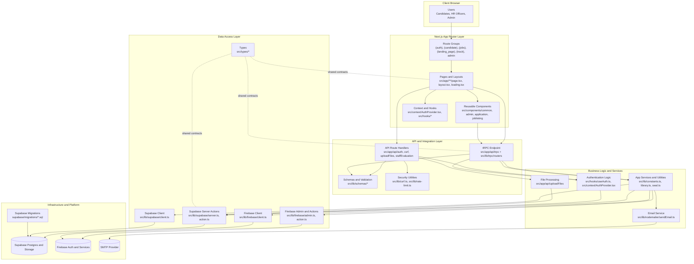

# AI-Driven Recruitment - Architecture Diagram


```

## Notes

- The app uses the Next.js App Router with route groups to separate user domains.
- API responsibilities are split between REST-like route handlers and tRPC procedures.
- Validation and security concerns are centralized in schema and utility modules.
- Supabase is the primary persistence layer; Firebase is used for complementary auth/service capabilities.
- Shared TypeScript types provide consistency across UI, API, and data-access boundaries.
